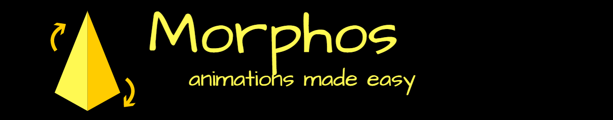

# Morphos


[](https://jitpack.io/#rjsvieira/morphos)




<h2> They say a pic is worth a 1000 words. Is it true to admit a .gif is worth a 1000 pics? </h2>
<kbd>   </kbd>

<h2>Include in your project</h2>

<h4> In your root/build.gradle</h4>

```groovy
allprojects {
  repositories {
  ...
  maven { url 'https://jitpack.io' }
  }
}  
```

<h4> In your app/build.gradle</h4>

```groovy
dependencies {
  compile 'com.github.rjsvieira:morphos:1.0.0'
}
```


Introducing Morphos : an animation wrapper. 
Morphos will take care of your views' animations without you having to write all that boring boilerplate code.


<h2>Initialization</h2>

Morphos are easy to interact with. Go ahead and create the following simple Morpho :

```java
View viewToAnimate = ... ;
Morpho morph = new Morpho(viewToAnimate)
  .translate(50,50,0,1500) // will translate the view (x=50,y=50,z=0) in 1500 milliseconds, 
  .rotationXY(45,45,2000); // will rotate the view by 45 degrees on both the X-axis and Y-axis in 2000 milliseconds
```

You can then animate it by doing 

```java
morph.animate(); 
```

Which will then animate the desired Morphos using the default animation type (SEQUENTIAL).

What if I want to reverse the animation? Sure, just do :

```java
morph.reverse();
```


<h2> Configuration </h2>

<h4>Create a Morpho</h4>

```java
Morpho morphoOne = new Morphos(view);
```

<h4>Configure the Morphos' animations</h4>

As of the first release, Morphos supports the 7 most basic and common animations.
Since Morphos has plenty of combinations for interpolation, animation type, duration, etc, the user is allowed to configure them according to his needs.
Every animation configuration method returns the Morphos object itself, thus allowing the user to chain his preferred animations.

Note : If the user does not specify the duration and/or interpolator, the animation will assume a 0 second duration and the default interpolator.

```java
alpha(double value)
alpha(double value, int duration)
alpha(double value, int duration, Interpolator interpolator)

scale(double valueX, double valueY)
scale(double valueX, double valueY, int duration)
scale(double valueX, double valueY, int duration, Interpolator interpolator)

translationX(AnimationTarget target, float valueX)
translationX(AnimationTarget target, float valueX, int duration)
translationX(AnimationTarget target, float valueX, int duration, Interpolator interpolator)

translationY(AnimationTarget target, float valueX)
translationY(AnimationTarget target, float valueX, int duration)
translationY(AnimationTarget target, float valueX, int duration, Interpolator interpolator)

translationZ(AnimationTarget target, float valueX)
translationZ(AnimationTarget target, float valueX, int duration)
translationZ(AnimationTarget target, float valueX, int duration, Interpolator interpolator)

translation(AnimationTarget target, float valueX, float valueY, float valueZ)
translation(AnimationTarget target, float valueX, float valueY, float valueZ, int duration)
translation(AnimationTarget target, float valueX, float valueY, float valueZ, int duration, Interpolator interpolator)

dimensions(float width, float height)
dimensions(float width, float height, int duration)
dimensions(float width, float height, int duration, Interpolator interpolator)

rotationXY(AnimationTarget target, double degreesX, double degreesY)
rotationXY(AnimationTarget target, double degreesX, double degreesY, int duration)
rotationXY(AnimationTarget target, double degreesX, double degreesY, int duration, Interpolator interpolator)

rotation(AnimationTarget target, double degrees)
rotation(AnimationTarget target, double degrees, int duration)
rotation(AnimationTarget target, double degrees, int duration, Interpolator interpolator)
```


Set a Listener to track the Morphos' animation process

```java
morphoOne.setListener(new Animator.AnimatorListener() {
  @Override
  public void onAnimationStart(Animator animator) {
      System.out.println("Start");
  }

  @Override
  public void onAnimationEnd(Animator animator) {
      System.out.println("End");
  }

  @Override
  public void onAnimationCancel(Animator animator) {

  }

  @Override
  public void onAnimationRepeat(Animator animator) {

  }
})  
```


<h4> Animate() the Morpho</h4>
This can be done through one of the several methods created just to make the invocation easier.
The animate() method's default values are : 
<br>
AnimationType : SEQUENTIAL - All animations are executed one sequentially
Duration : -1 - Since no duration was specified, -1 is assumed thus executing every animation in its given duration. For example : morphoOne.translate(100,0,0,3000).scale(2,2,2000).animate() will execute the translation animation in 3 seconds, followed by an upscale animation of 2 seconds
Interpolator - The overall interpolator (LinearInterpolator)


```java
animate()
animate(AnimationType type, int duration)
animate(AnimationType type, int duration, Interpolator interpolator)
```


<h4>Reverse</h4>

After executing animate(), the user can rollback the animation by invoking the reverse() method.
The reverse method works just like the animate() method, having the same combinations and parameters.


```java
reverse()
reverse(AnimationType type, int duration)
reverse(AnimationType type, int duration, Interpolator interpolator)
```


<h4>Cancel</h4>

If the user wishes to cancel the on-going animation by any reason, he can do so by invoking the cancel method : 

```java
morphoOne.cancel();
```


<h4>updateView</h4>

Like the method explicitly indicates, the user can update the view associated with the Morpho. This will clear every animation already configured for the given object. 
updateView(View v) also invokes reset();

```java
morphoOne.updateView(newView);
```


<h4>Reset</h4>

If by any chance the user wants to reset he Morpho and re-build it from scratch, he can do so by invoking the reset() method

```java
morphoOne.reset()
```


<h4>Dispose</h4>

Last but not least, if they user wishes to discard the Morphos object, he can invoke the dispose() method, thus clearing and preparing the Morphos' inner variables for garbage collection.

```java
morphoOne.dispose();
```

